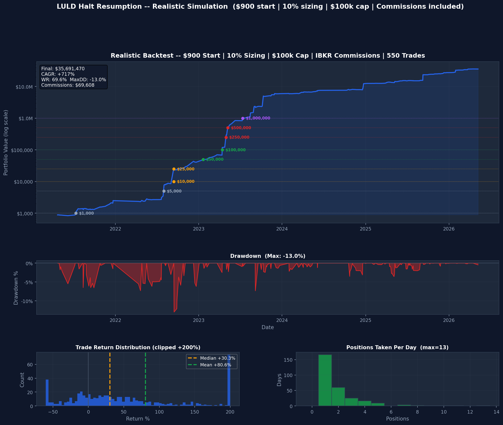

# LULD Halt Resumption Strategy

A systematic intraday trading strategy that buys NASDAQ LULD (Limit Up-Limit Down)
halt resumptions and exits at 3:50 PM ET. Backtested April 2021 – May 2026.

## Results

| Metric | Value |
|--------|-------|
| Trades | 550 |
| Win rate (net of commissions) | **69.6%** |
| Median trade return | **+30.3%** |
| Max drawdown | **-13.0%** |
| CAGR from $900 start | +717% |
| Total commissions paid | $69,608 |



---

## Repository Structure

### `bot/` — Live Trading Bot
Automated bot that runs on a Linux server and trades the strategy in real time via IBKR.
- Edit `bot/config.py` to change parameters
- See `docs/server_setup.md` to deploy on a new server
- See `docs/deployment.md` to push updates

### `research/` — Backtesting & Analysis
Complete research framework. All data is included — clone and run immediately.

```bash
pip install pandas numpy matplotlib scipy pyarrow
python research/backtest/realistic_backtest.py
```

Key scripts:
| Script | What it does |
|--------|-------------|
| `research/backtest/realistic_backtest.py` | Main backtest — $900 start, 10% sizing, IBKR commissions |
| `research/backtest/sizing_comparison.py` | Compare 5% / 10% / 25% / 50% position sizing |
| `research/backtest/pyramid_vs_single.py` | Pyramiding vs one trade per ticker per day |
| `research/analysis/exit_volume_analysis.py` | Does exit liquidity predict returns? |
| `research/analysis/prehalt_volume_analysis.py` | Does pre-halt volume predict returns? |

Data is in `research/data/` — see `research/data/README.md` for full data dictionary.

---

## Strategy Logic

1. **Signal** — NASDAQ RSS feed detects `LUDP` halt code (Limit Up pause)
2. **Filter** — Stock is ≥2% above session open (halt-up) AND RVOL ≥ 1.0
3. **Entry** — Market order at halt resumption
4. **Sizing** — 10% of beginning-of-day equity, hard cap $100k/trade
5. **Exit** — Market order at 3:50 PM ET, no exceptions

---

## Docs

- [Server Setup](docs/server_setup.md) — How to install and configure the bot on DigitalOcean
- [Deployment](docs/deployment.md) — How to push code updates to the server
- [Data Dictionary](research/data/README.md) — Column definitions for all datasets

---

## Quick Start (Research Only)

```bash
git clone https://github.com/gilbertknight-star/Trade-Halts
cd Trade-Halts
pip install pandas numpy matplotlib scipy pyarrow
python research/backtest/realistic_backtest.py
```

Outputs: chart saved to `research/results/realistic_backtest.png`, trades to `research/data/realistic_backtest_trades.csv`.
